# SS_chatroom1
## Midterm -- Chat Room

### Introduction
This is a chatroom project written by HTML, CSS, JS and React.

### Scoring

| **Basic components** | **Score** | **Check** |
| :------------------- | :-------: | :-------: |
| Membership Mechanism   |    5%    |     Y     |
| Firebase page hosting           |    5%    |     Y     |
| Database read/write           |    15%    |     Y     |
| RWD       |    15%     |     Y     |
| Git       |    5%     |     Y     |
| Chatroom       |    20%     |     Y     |

| **Advanced components**     | **Score** | **Check** |
| :--------------------- | :-------: | :-------: |
| Use React |    10%    |     Y     |
| Sign in with third party (Google)             |    1%     |     Y     |
| Add Chrome notification        |    5%    |     Y     |
| CSS animation             |    2%     |     Y     |
|Deal with sending code problems               |    2%     |     Y     |

| **Bonus Components** | **Score** | **Check** |
| :----------------------- | :-------: | :-------: |
| User profile    |   1%    |     Y ? Email not editable    |
| Profile picture    |   1%    |     Y     |
| Chatbot    |   2%    |     Y     |
| Unsend Message    |   3%    |     Y     |


### Set up environment
After downloading the code folders,
use these 3 commands
 ```bash
 cd chatroom
 npm install
 npm start
 ```
and the website would show up on your browser at `localhost:3000/`

### How to use

#### 1. Login Page
You could type your email and password in the input bar. 
If this is your first-time to log in, remember to use **New account** rather than Sign in, or their would be alert message.

* **Login** : <br>
    This is the login page, the below is the error message of new user using Sign in.

    * Error Message
        <p>
        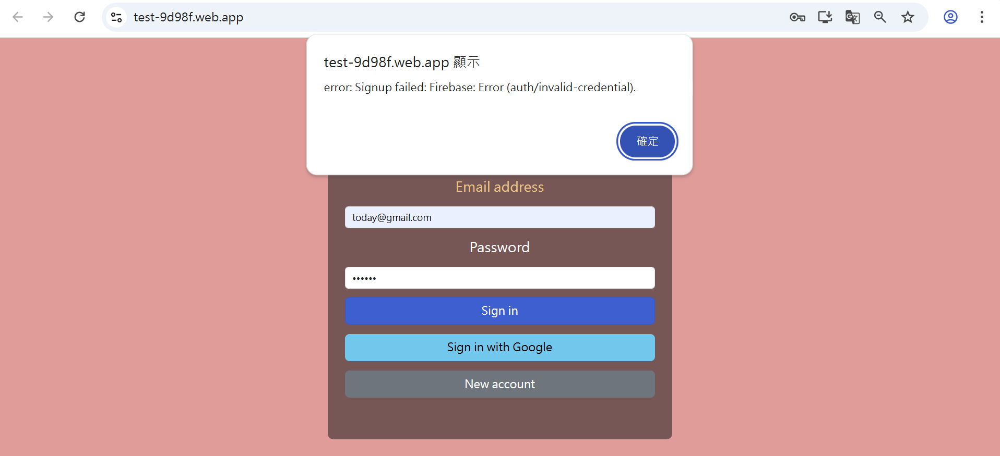
        </p>

    * Login
        <p>
        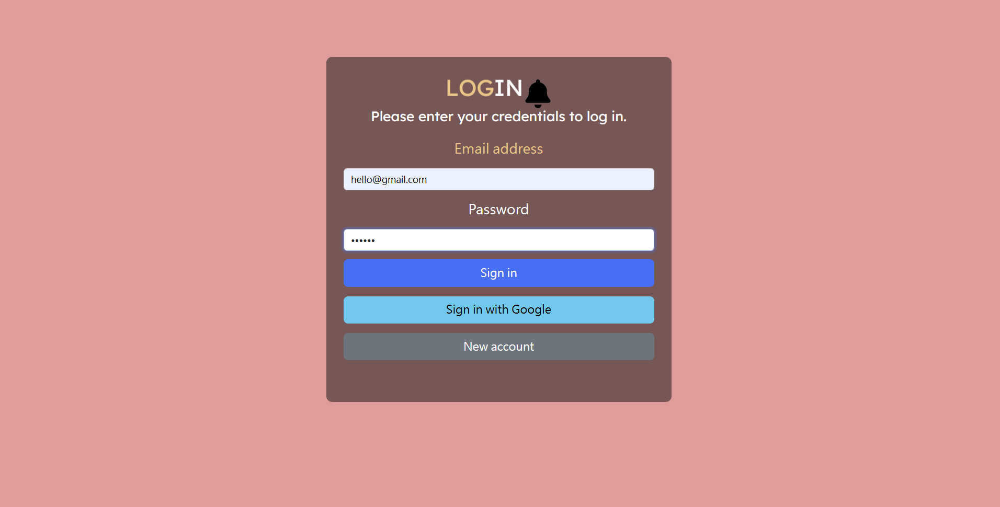
        </p>
    
    * Login animation
        <p>
        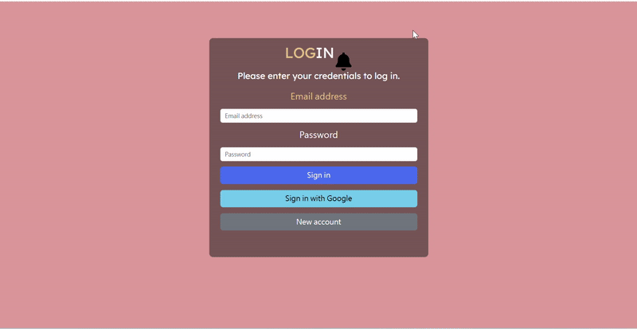
        </p>
    
* **Chrome Notification Bell** : <br>
By pressing this bell button, the user could accept permission of chrome notification.<br>
After agreeing, when login success, chrome could send notification to you.
    * Ask for permission
        <p>
        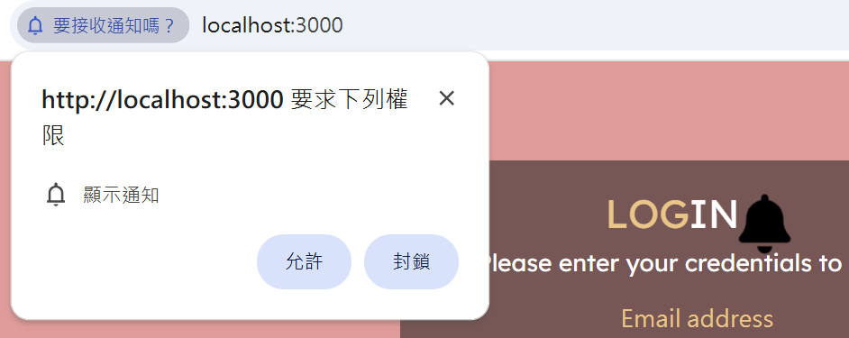
        </p>
    * Chrome nortification
        <p>
        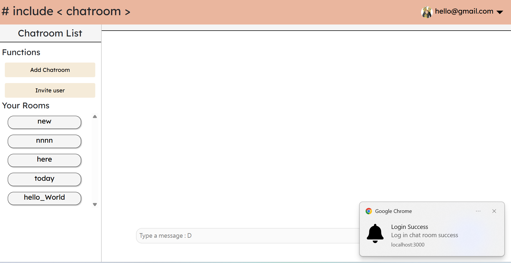
        </p>

#### 2. Chatroom page
The user interface is divided into sections: the top of the page contains the navigation bar (Navbar), the left side displays function buttons and the list of chatrooms, and the right side shows the currently selected chatroom name along with its messages.

##### Navbar
<p>
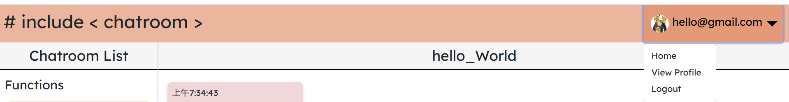
</p>

* **include animation** : <br>
There is a CSS animation that made the text "# include &lt; chatroom &gt;" appear on the screen when switching page. (from login to chatroom or from chatroom to profile)

    <p>
    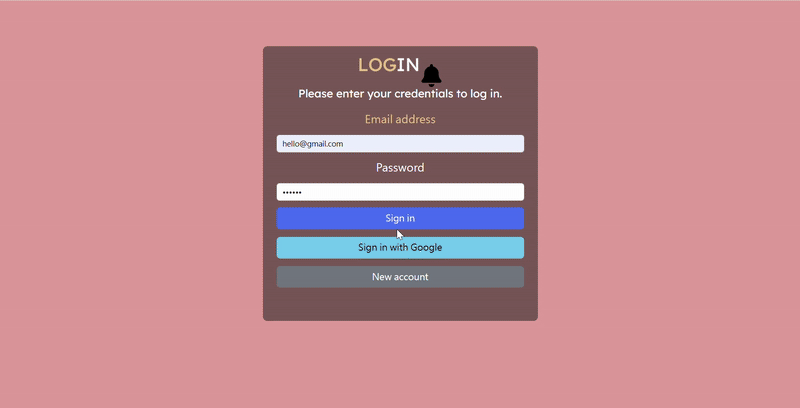
    </p>

* **Dropdown menu** : <br>
This is a menu for switching between different pages.
    * Home = Chatroom page
    * Profile = Profile page
    * Logout = logout of the chatroom, back to Login page

* **Personal info** : <br>
In the upper-right corner of the Navbar, the user's email and profile photo are displayed. The photo can be set or updated on the `Profile page`.


##### Function buttons
<p>
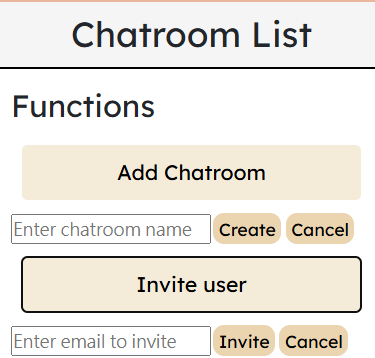
</p>

* **Add Chatroom** :
This button lets users create a new chatroom by entering a name in the text input field.

* **Invite user**
Users can use this button to invite someone **already registered on the site** to join the current chatroom by entering their name.
The input field appears only **when the user is in a chatroom already**


##### Room List
This area displays all the chatrooms that the current user is a member of, as users cannot see chatrooms they haven't been invited to.
The chatroom the user is currently in will have a darker background to indicate it's active.
<p>
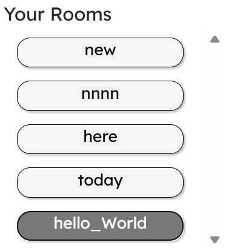
</p>


##### Chatroom messages
The history messages of the selected chatroom would be shown on this part. Also, messages from current user are marked as green, from chatbot are marked as yellow while from other users are marked as pink.

* **Input message** :  <br>
User can type and send message **only when they are already un a chatroom.**
    <p>
    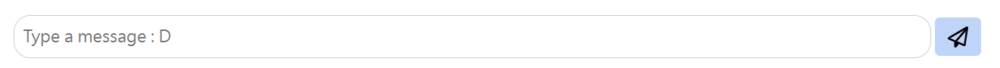
    </p>


* **Delete** : <br>
By clicking the trash-can icon, user could unsend the messages. Every user could only unsent the messages they sent.
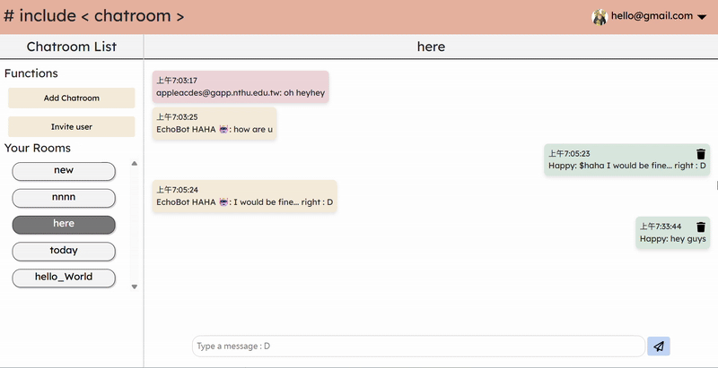

* **Chatbot** : <br>
There is a chatbot that could be triggered by typing `$haha` in the beginning of the message.<br>
HAHA is an echo bot, it would repeat what you said.
    <p>
    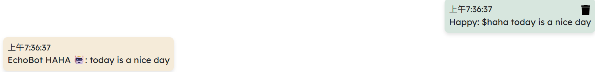
    </p>

    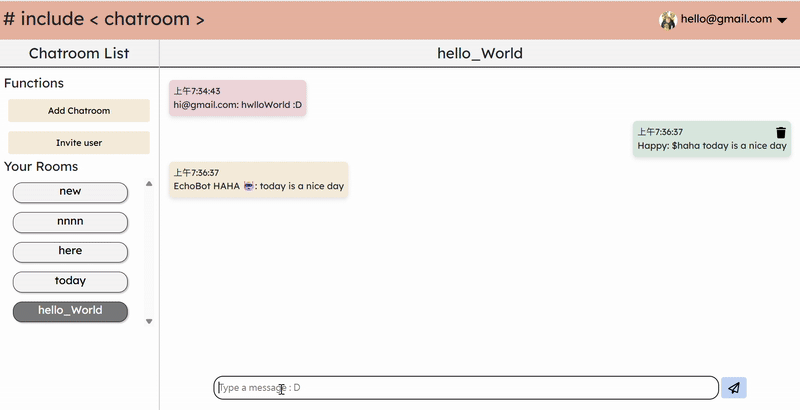

    <!--  -->


#### 3. Profile page
There are several fields that are editable and savable for the user.
* **PhotoURL** : <br>
User can paste a online picture link here and their photo could be changed to the picture.

* **Username** : <br>
A input field that you could enter your username in. After update, the username would shown in the message part.
* **Email** : <br>
I set this field as "read-only".
* **Phone** : <br>
A input field that you could enter your phone in.
* **Address** : <br>
A input field that you could enter your address in.

After filling in all the fields you want to update, click the `Update` button below. An alert will appear indicating that the update has been completed.

* Update profile
    <p>
        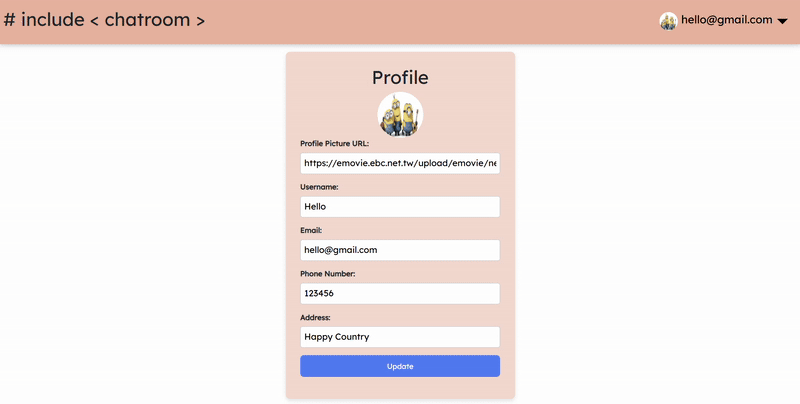
    </p>

* After Update
    <p>
        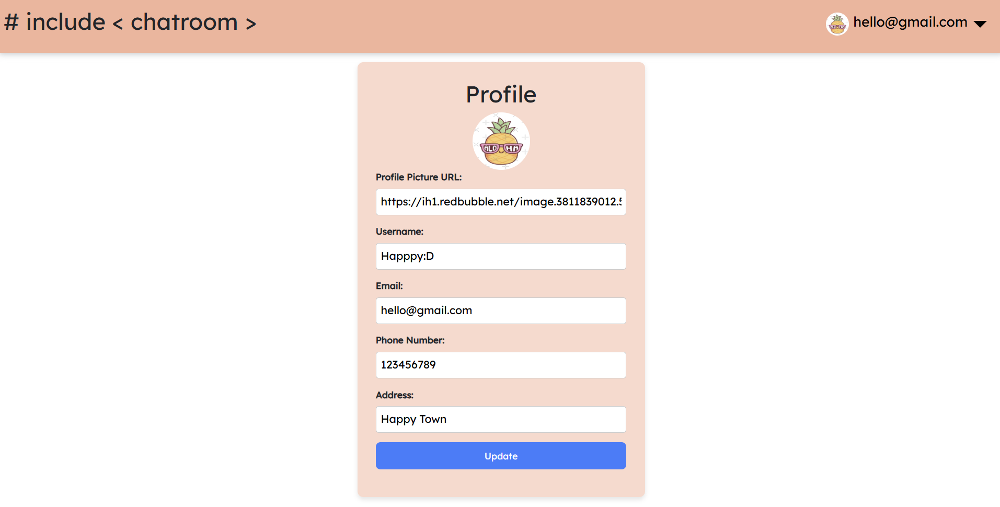
    </p>

### Git commit history
Here is the screenshots of git commit history
<p>
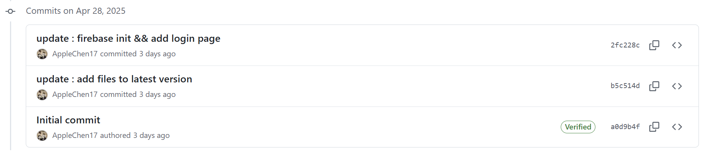

</p>
<p>
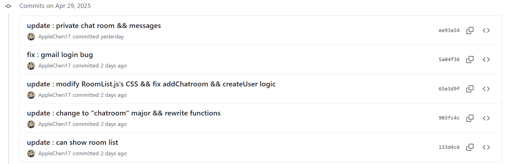

</p>
<p>
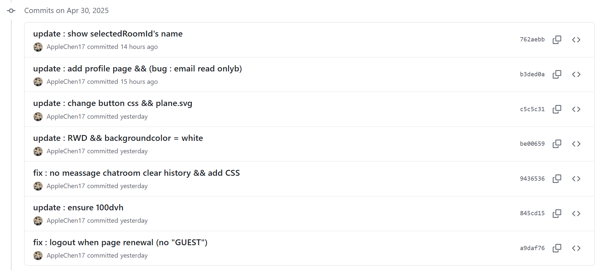

</p>
<p>
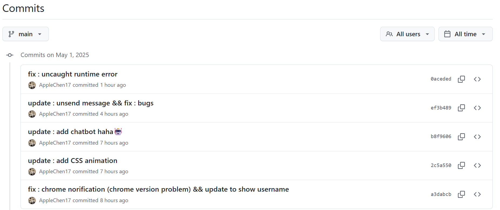

</p>


### Web Link
```
https://myawesomechatroom-f1848.web.app/
```
